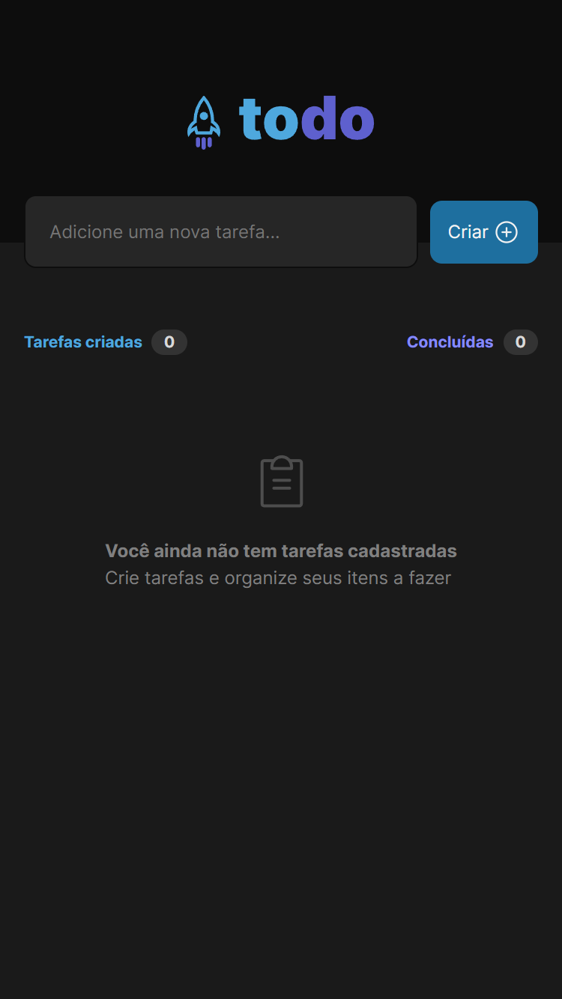

# 

## 📋 Descrição
Todo App foi criado para resolução do desafio do curso Ignite (trilha atualizada) da Rocketseat. Essa aplicação apesar de simples é um excelente exemplo para praticar o desenvolvimento de apps CRUD (Create, Read, Update, Delete).

## 📁 Acesso ao projeto
Você pode acessar os arquivos do projeto clicando [aqui](https://ismaelczar.github.io/todo-list/). <br /><br />

## 🎨 Layout 

Desktop
<p >
  
</p>

Mobile
<p >
  
  
</p>


## ✔️ Técnicas e tecnologias utilizadas

<h3><a href="https://vitejs.dev/">&nbsp Vite</a> - 🚀ferramenta de construção de interface</h3>

- ``React``
- ``TypeScript``
- ``Vite``

## 🚀 Preparando A Aplicação

1 - Clone Este Repositório

2 - Abra o VS Code ou sua IDE de preferência e acesse a pasta do repositório

3 - Após isso, digite o seguinte comando para instalação dos pacotes da aplicação

```jsx
npm install
```

4 - Após a instalação das dependências, será necessário rodar o projeto com o seguinte comando:

```jsx
npm run dev
```
Abra http://localhost:3000 para visualizar no navegador.

Por fim, sua aplicação está pronta para uso, faça bom proveito ;)

## ✒️ Autor

- **Ismael Cézar** - _Desenvolvedor Responsável_ - [Ismael Cézar ](https://github.com/ismaelczar)
